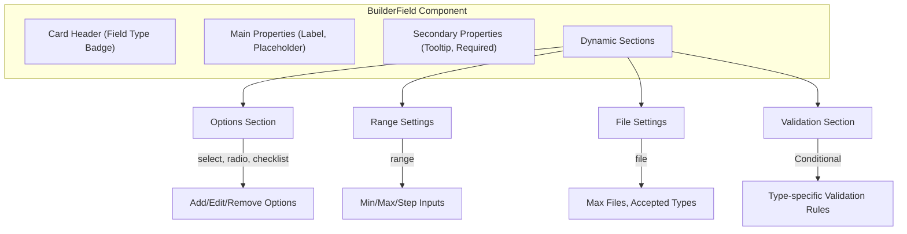
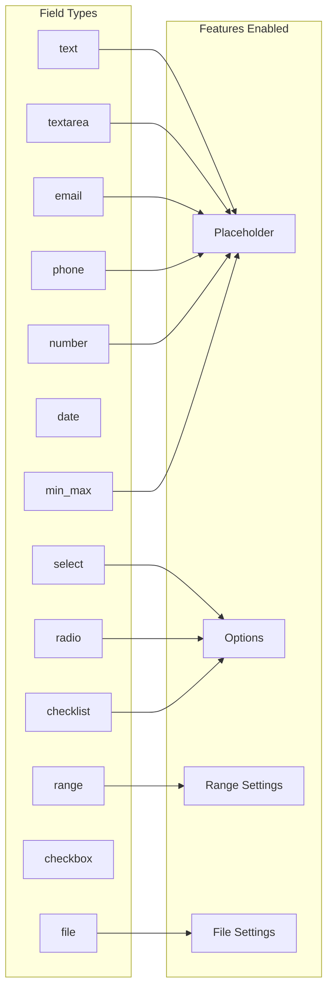
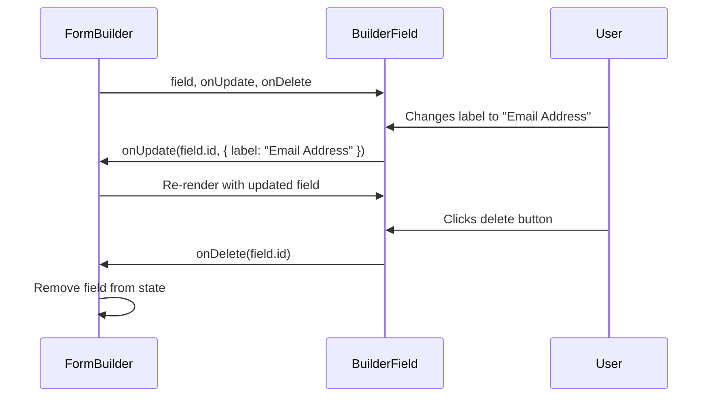
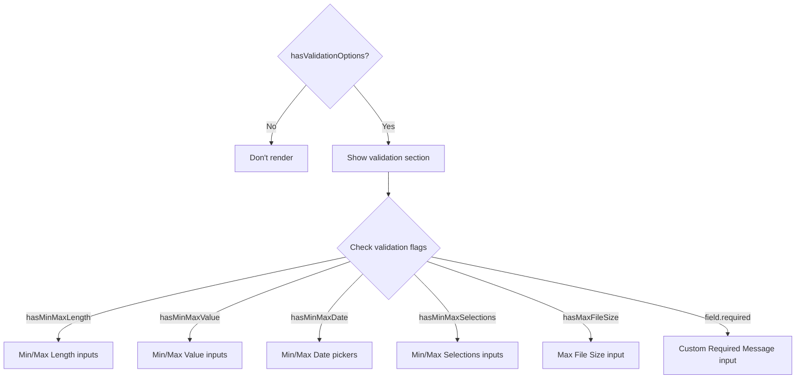
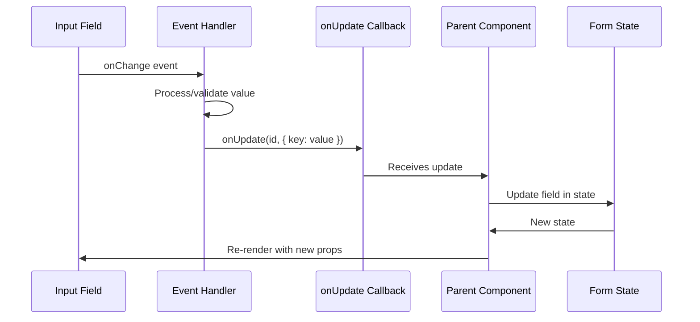

# BuilderField Component Documentation

> **File:** [BuilderField.tsx](file:///d:/Projects/Calendar/src/components/form-builder/BuilderField.tsx)  
> **Purpose:** Renders and manages individual form field configurations in the Form Builder interface.

---

## Overview

The `BuilderField` component is the core building block of the Form Builder. It provides an interactive UI for configuring each form field's properties, validation rules, and type-specific settings.



---

## Architecture

### Component Structure

```
BuilderField.tsx
├── Type Definitions
│   ├── FieldType (derived from FormFieldInternal)
│   └── FieldConfig (configuration interface)
├── FIELD_CONFIG (static configuration object)
├── Helper Functions
│   ├── getFieldConfig()
│   ├── hasValidationOptions()
│   └── handleNonNegativeInput()
└── BuilderField Component
    ├── State Handlers
    │   ├── handleOptionAdd/Change/Remove
    │   ├── handleFileTypeToggle
    │   └── updateValidation
    └── Render Sections
        ├── renderOptionsSection()
        ├── renderRangeSettings()
        ├── renderFileSettings()
        └── renderValidationSection()
```

---

## Field Configuration System

### The `FieldConfig` Interface

Each field type has a configuration that determines which UI sections are displayed:

```typescript
interface FieldConfig {
  hasPlaceholder: boolean;      // Show placeholder input?
  hasOptions: boolean;          // Show options manager?
  hasRangeSettings: boolean;    // Show min/max/step inputs?
  hasFileSettings: boolean;     // Show file upload settings?
  validation: {
    hasMinMaxLength: boolean;      // Text length validation
    hasMinMaxValue: boolean;       // Numeric value validation
    hasMinMaxDate: boolean;        // Date range validation
    hasMinMaxSelections: boolean;  // Selection count validation
    hasMaxFileSize: boolean;       // File size validation
    hasDisableSpinners: boolean;   // Number input spinners
  };
}
```

### FIELD_CONFIG Mapping

The `FIELD_CONFIG` object maps each `FieldType` to its configuration:



### Configuration Examples

| Field Type | Placeholder | Options | Range | File | Validation Features |
|------------|:-----------:|:-------:|:-----:|:----:|---------------------|
| `text` | ✅ | ❌ | ❌ | ❌ | Min/Max Length |
| `textarea` | ✅ | ❌ | ❌ | ❌ | Min/Max Length |
| `email` | ✅ | ❌ | ❌ | ❌ | *(built-in pattern)* |
| `phone` | ✅ | ❌ | ❌ | ❌ | *(built-in pattern)* |
| `number` | ✅ | ❌ | ❌ | ❌ | Min/Max Value, Disable Spinners |
| `date` | ❌ | ❌ | ❌ | ❌ | Min/Max Date |
| `select` | ❌ | ✅ | ❌ | ❌ | - |
| `radio` | ❌ | ✅ | ❌ | ❌ | - |
| `checklist` | ❌ | ✅ | ❌ | ❌ | Min/Max Selections |
| `range` | ❌ | ❌ | ✅ | ❌ | - |
| `file` | ❌ | ❌ | ❌ | ✅ | Max File Size |
| `checkbox` | ❌ | ❌ | ❌ | ❌ | - |
| `min_max` | ✅ | ❌ | ❌ | ❌ | Min/Max Value |

---

## Component Props

```typescript
interface BuilderFieldProps {
  field: FormFieldInternal;  // The field data being configured
  onUpdate: (id: string, updates: Partial<FormFieldInternal>) => void;  // Update callback
  onDelete: (id: string) => void;  // Delete callback
}
```

### Data Flow



---

## Helper Functions

### `getFieldConfig(type: FieldType)`

Retrieves the configuration for a given field type with a fallback to `text` config:

```typescript
const getFieldConfig = (type: FieldType): FieldConfig =>
  FIELD_CONFIG[type] || FIELD_CONFIG.text;
```

### `hasValidationOptions(field: FormFieldInternal)`

Determines if the validation section should be displayed:

```typescript
const hasValidationOptions = (field: FormFieldInternal): boolean => {
  const config = getFieldConfig(field.type);
  const { validation } = config;
  return (
    validation.hasMinMaxLength ||
    validation.hasMinMaxValue ||
    validation.hasMinMaxDate ||
    validation.hasMinMaxSelections ||
    validation.hasMaxFileSize ||
    field.required  // Always show if required
  );
};
```

### `handleNonNegativeInput(value: string)`

Ensures numeric inputs cannot be negative:

```typescript
const handleNonNegativeInput = (value: string): number | undefined => {
  if (!value) return undefined;
  const num = parseInt(value);
  return num >= 0 ? num : 0;
};
```

---

## Render Sections

### Main Card Structure

```
┌─────────────────────────────────────────────────────────────────┐
│ [Delete Button]                                                 │
├─────────────────────────────────────────────────────────────────┤
│ ┌──────────┐                                                    │
│ │  TEXT    │  ← Field Type Badge                               │
│ └──────────┘                                                    │
├─────────────────────────────────────────────────────────────────┤
│  ┌─────────────────────────┐  ┌─────────────────────────┐       │
│  │ Label                   │  │ Placeholder             │       │
│  │ [Email Address       ]  │  │ [Enter your email    ]  │       │
│  └─────────────────────────┘  └─────────────────────────┘       │
│                                                                 │
│  ┌─────────────────────────┐  ┌─────────────────────────┐       │
│  │ Tooltip (Optional)      │  │ [Switch] Required Field │       │
│  │ [Help text for user  ]  │  │                         │       │
│  └─────────────────────────┘  └─────────────────────────┘       │
├─────────────────────────────────────────────────────────────────┤
│ ┌─ Options Section ──────────────────────────────────────────┐  │
│ │ (Only for select, radio, checklist)                        │  │
│ └────────────────────────────────────────────────────────────┘  │
├─────────────────────────────────────────────────────────────────┤
│ ┌─ Range Settings ───────────────────────────────────────────┐  │
│ │ (Only for range)                                           │  │
│ └────────────────────────────────────────────────────────────┘  │
├─────────────────────────────────────────────────────────────────┤
│ ┌─ File Settings ────────────────────────────────────────────┐  │
│ │ (Only for file)                                            │  │
│ └────────────────────────────────────────────────────────────┘  │
├─────────────────────────────────────────────────────────────────┤
│ ┌─ Validation Rules ─────────────────────────────────────────┐  │
│ │ (Conditional based on field type)                          │  │
│ └────────────────────────────────────────────────────────────┘  │
└─────────────────────────────────────────────────────────────────┘
```

---

### Options Section (select, radio, checklist)

Displays for fields that need user-defined options:

```
┌─ OPTIONS ────────────────────────────────────────┐
│  Options                          [+ Add Option] │
│  ┌────────────────────────────────┐ ┌───┐        │
│  │ Option 1                       │ │ X │        │
│  └────────────────────────────────┘ └───┘        │
│  ┌────────────────────────────────┐ ┌───┐        │
│  │ Option 2                       │ │ X │        │
│  └────────────────────────────────┘ └───┘        │
│  ┌────────────────────────────────┐ ┌───┐        │
│  │ Option 3                       │ │ X │        │
│  └────────────────────────────────┘ └───┘        │
└──────────────────────────────────────────────────┘
```

**Handler Functions:**
- `handleOptionAdd()` - Adds a new option with default name
- `handleOptionChange(index, value)` - Updates an option's value
- `handleOptionRemove(index)` - Removes an option from the list

---

### Range Settings Section (range)

Configures slider min/max/step values:

```
┌─ RANGE SETTINGS ─────────────────────────────────┐
│  ┌─────────┐  ┌─────────┐  ┌─────────┐           │
│  │ Min     │  │ Max     │  │ Step    │           │
│  │ [  0  ] │  │ [ 100 ] │  │ [  1  ] │           │
│  └─────────┘  └─────────┘  └─────────┘           │
└──────────────────────────────────────────────────┘
```

---

### File Settings Section (file)

Configures file upload restrictions:

```
┌─ FILE SETTINGS ──────────────────────────────────┐
│  Max Files                                       │
│  ┌───────────────┐  [✓] Unlimited                │
│  │      3        │                               │
│  └───────────────┘                               │
│                                                  │
│  Accepted File Types                             │
│  [✓] Images (jpg, png, gif)                      │
│  [✓] PDF (.pdf)                                  │
│  [ ] Word (.doc, .docx)                          │
│  [ ] Excel (.xls, .xlsx)                         │
│  [ ] Text (.txt)                                 │
│  [ ] CSV (.csv)                                  │
└──────────────────────────────────────────────────┘
```

**Available File Types:**

```typescript
const FILE_TYPE_OPTIONS = [
  { label: 'Images (jpg, png, gif)', value: 'image/*' },
  { label: 'PDF (.pdf)', value: '.pdf' },
  { label: 'Word (.doc, .docx)', value: '.doc,.docx' },
  { label: 'Excel (.xls, .xlsx)', value: '.xls,.xlsx' },
  { label: 'Text (.txt)', value: '.txt' },
  { label: 'CSV (.csv)', value: '.csv' },
];
```

---

### Validation Section

Displays conditional validation inputs based on field type:



**Validation Examples by Field Type:**

#### Text/Textarea Field
```
┌─ VALIDATION RULES ───────────────────────────────┐
│  ┌─────────────┐  ┌─────────────┐                │
│  │ Min Length  │  │ Max Length  │                │
│  │ [   5    ]  │  │ [  100   ]  │                │
│  └─────────────┘  └─────────────┘                │
│                                                  │
│  Custom Required Message                         │
│  ┌─────────────────────────────────────────────┐ │
│  │ Please enter your full name                 │ │
│  └─────────────────────────────────────────────┘ │
└──────────────────────────────────────────────────┘
```

#### Number Field
```
┌─ VALIDATION RULES ───────────────────────────────┐
│  ┌─────────────┐  ┌─────────────┐                │
│  │ Min Value   │  │ Max Value   │                │
│  │ [   0    ]  │  │ [  1000  ]  │                │
│  └─────────────┘  └─────────────┘                │
│                                                  │
│  [✓] Disable scroll & increment/decrement buttons│
└──────────────────────────────────────────────────┘
```

#### Date Field
```
┌─ VALIDATION RULES ───────────────────────────────┐
│  ┌─────────────┐  ┌─────────────┐                │
│  │ Min Date    │  │ Max Date    │                │
│  │ [2024-01-01]│  │ [2024-12-31]│                │
│  └─────────────┘  └─────────────┘                │
└──────────────────────────────────────────────────┘
```

#### Checklist Field
```
┌─ VALIDATION RULES ───────────────────────────────┐
│  ┌───────────────┐  ┌───────────────┐            │
│  │ Min Selections│  │ Max Selections│            │
│  │ [     1     ] │  │ [     3     ] │            │
│  └───────────────┘  └───────────────┘            │
└──────────────────────────────────────────────────┘
```

#### File Field
```
┌─ VALIDATION RULES ───────────────────────────────┐
│  Max File Size per File (KB)                     │
│  ┌─────────────────────────────────────────────┐ │
│  │               5000                          │ │
│  └─────────────────────────────────────────────┘ │
│  Applied to each individual file                 │
└──────────────────────────────────────────────────┘
```

---

## State Update Pattern

All field updates follow a consistent pattern using the `onUpdate` callback:

```typescript
// Example: Updating the label
onUpdate(field.id, { label: "New Label" });

// Example: Updating validation
const updateValidation = (updates: Partial<FormFieldInternal['validation']>) => {
  onUpdate(field.id, { validation: { ...field.validation, ...updates } });
};

// Usage
updateValidation({ minLength: 5, maxLength: 100 });
```

### Update Flow Diagram



---

## Usage Example

```tsx
import { BuilderField } from './BuilderField';
import { FormFieldInternal } from './types';

function FormBuilder() {
  const [fields, setFields] = useState<FormFieldInternal[]>([]);

  const handleUpdate = (id: string, updates: Partial<FormFieldInternal>) => {
    setFields(prev => prev.map(field => 
      field.id === id ? { ...field, ...updates } : field
    ));
  };

  const handleDelete = (id: string) => {
    setFields(prev => prev.filter(field => field.id !== id));
  };

  return (
    <div>
      {fields.map(field => (
        <BuilderField
          key={field.id}
          field={field}
          onUpdate={handleUpdate}
          onDelete={handleDelete}
        />
      ))}
    </div>
  );
}
```

---

## Complete Field Type Reference

### Text-Based Fields

| Type | Description | Validation Options |
|------|-------------|-------------------|
| `text` | Single-line text input | Min/Max Length |
| `textarea` | Multi-line text area | Min/Max Length |
| `email` | Email input with built-in validation | - |
| `phone` | Phone number input | - |

### Numeric Fields

| Type | Description | Validation Options |
|------|-------------|-------------------|
| `number` | Numeric input | Min/Max Value, Disable Spinners |
| `range` | Slider input | Min/Max/Step settings |
| `min_max` | Min/Max pair input | Min/Max Value |

### Selection Fields

| Type | Description | Validation Options |
|------|-------------|-------------------|
| `select` | Dropdown selection | - |
| `radio` | Radio button group | - |
| `checklist` | Multi-select checkboxes | Min/Max Selections |
| `checkbox` | Single checkbox | - |

### Other Fields

| Type | Description | Validation Options |
|------|-------------|-------------------|
| `date` | Date picker | Min/Max Date |
| `file` | File upload | Max Files, Max File Size, Accepted Types |

---

## Related Files

- [types.ts](file:///d:/Projects/Calendar/src/components/form-builder/types.ts) - Type definitions
- [FormBuilder.tsx](file:///d:/Projects/Calendar/src/components/form-builder/FormBuilder.tsx) - Parent component
- [FormViewer.tsx](file:///d:/Projects/Calendar/src/components/form-builder/FormViewer.tsx) - Form rendering
- [Sidebar.tsx](file:///d:/Projects/Calendar/src/components/form-builder/Sidebar.tsx) - Field type selector
