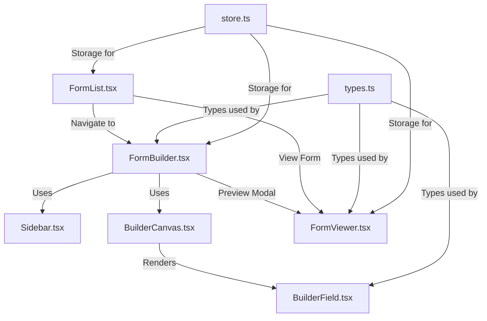

# Form Builder - Code Walkthrough Guide

This document provides a detailed guide to understanding the Form Builder codebase. Follow the files in the order listed below for the best learning experience.

---

## Architecture Overview



---

## File Reading Order

### 1. Start with Types (`types.ts`)
**Purpose**: Defines all TypeScript interfaces and types used across the form builder.

**Key exports**:
- `FieldType` - Union type of all supported field types (text, email, phone, date, file, etc.)
- `FieldValidation` - Validation configuration (minLength, maxLength, minDate, maxDate, etc.)
- `FormField` - Base field interface with label, placeholder, required, validation, etc.
- `FormFieldInternal` - Extends FormField with an `id` property
- `FormSchema` - Complete form structure with id, name, description, and fields array

**Read this first** to understand the data structures before diving into components.

---

### 2. Storage Layer (`store.ts`)
**Purpose**: Handles localStorage persistence for forms.

**Key functions**:
- `saveForm(schema)` - Saves a form to localStorage
- `getForm(id)` - Retrieves a specific form by ID
- `getAllForms()` - Gets all saved forms
- `deleteForm(id)` - Removes a form from storage

**Why second**: Understanding storage helps you see how forms are persisted.

---

### 3. Entry Point (`FormList.tsx`)
**Purpose**: The main landing page showing all saved forms.

**What it does**:
- Displays a grid of saved forms
- "Create New Form" button → navigates to `/form-builder/new`
- "Edit" button → navigates to `/form-builder/edit/:id`
- "View" button → navigates to `/form-builder/view/:id`
- "Delete" button → removes form from storage

**Route**: `/form-builder`

---

### 4. Form Builder Main Component (`FormBuilder.tsx`)
**Purpose**: The core builder interface for creating/editing forms.

**Key state**:
- `fields` - Array of FormFieldInternal objects
- `formName` - The form's title
- `formDescription` - Optional description
- `isPreviewOpen` - Controls preview modal visibility

**Key functions**:
- `handleAddField(type)` - Called when user clicks a field type in sidebar
- `handleDeleteField(id)` - Removes a field from the form
- `handleUpdateField(id, updates)` - Updates a field's properties
- `handleSaveClick()` - Opens preview modal
- `handleConfirmSave()` - Saves form to storage and navigates back

**Layout**:
```
┌─────────────────────────────────────────────────────┐
│ Header (Back button, title, Save button)            │
├──────────────┬──────────────────────────────────────┤
│              │                                      │
│   Sidebar    │        BuilderCanvas                 │
│  (Field      │     (Form header inputs +            │
│   types)     │      draggable fields)               │
│              │                                      │
└──────────────┴──────────────────────────────────────┘
```

---

### 5. Sidebar Component (`Sidebar.tsx`)
**Purpose**: Left panel with buttons to add new field types.

**How it works**:
- Receives `onAddField` prop from FormBuilder
- Each button calls `onAddField(fieldType)` with the respective type
- Uses Lucide icons for visual representation

**Supported fields**: Text, Textarea, Number, Email, Phone, Date, File, Checkbox, Checklist, Radio, Select, Range, Min-Max

---

### 6. Builder Canvas (`BuilderCanvas.tsx`)
**Purpose**: The main editing area that renders all form fields.

**Props**:
- `fields` - Array of fields to render
- `onUpdateField` - Callback to update a field
- `onDeleteField` - Callback to delete a field

**What it does**:
- Maps through fields array
- Renders a `BuilderField` component for each field
- Handles drag-and-drop reordering (if implemented)

---

### 7. Builder Field Component (`BuilderField.tsx`)
**Purpose**: Individual field editor card in the builder.

**Key sections**:
1. **Header** - Shows field type badge + delete button
2. **Main Properties** - Label and Placeholder inputs
3. **Secondary Properties** - Tooltip input and Required toggle
4. **Type-Specific Sections**:
   - Options editor (for select/checklist/radio)
   - Range settings (for range type)
   - File settings (max files, accepted types)
5. **Validation Rules** (conditional display):
   - Text/Textarea: Min/Max Length
   - Date: Min/Max Date
   - Number: Min/Max Value
   - Checklist: Min/Max Selections
   - File: Max File Size per file
   - All required fields: Custom Required Message

**Helper function**: `hasValidationOptions(field)` determines if validation section should show.

---

### 8. Form Viewer (`FormViewer.tsx`)
**Purpose**: Renders a form for actual user input and submission.

**Can be used in two modes**:
1. **Standalone** - Load form from URL param (`/form-builder/view/:id`)
2. **Embedded** - Pass schema as prop (used in preview modal)

**Key sections**:

#### A. RenderField Component
Switch statement that renders the appropriate input for each field type:
- `textarea` → Textarea component
- `select` → Native select dropdown
- `checkbox` → Single checkbox with label
- `checklist` → Multiple checkboxes
- `radio` → Radio button group
- `file` → Drag-and-drop file upload with preview
- `range` → Range slider with value display
- `min_max` → Two number inputs (min/max)
- `default` → Text/Number/Email/Phone/Date input

#### B. Validation Rules Generation
For each field, generates react-hook-form validation rules:
- Required validation with custom messages
- String length validation (text/textarea only)
- Built-in patterns (email, phone)
- Date range validation
- Number range validation
- Checklist selection count
- File size and count validation

#### C. Form Submission
`handleFormSubmit(data)` creates a payload with:
- Complete form schema (id, name, description)
- All fields with their values embedded
- `submittedAt` timestamp

---

### 9. Utility Files

#### `utils.ts`
Helper functions like `slugify()` for converting labels to URL-safe strings.

---

## Data Flow

### Creating a Form
```
1. User clicks "Create New Form" in FormList
2. Navigate to FormBuilder
3. User clicks field type in Sidebar
   → handleAddField() creates new field with UUID
4. User edits field in BuilderField
   → handleUpdateField() updates state
5. User clicks "Save Form"
   → Opens FormViewer in preview modal
6. User clicks "Confirm & Save"
   → saveForm() stores to localStorage
   → Navigate back to FormList
```

### Viewing/Submitting a Form
```
1. User clicks "View" in FormList
2. FormViewer loads schema from store
3. useForm() creates react-hook-form instance
4. User fills in fields
5. Validation runs on each field change
6. User clicks "Submit"
   → handleFormSubmit() creates payload
   → Payload includes full schema + values
```

---

## Key Patterns

### 1. Field ID Generation
Fields use UUID v4 for unique identification: `field_${uuidv4()}`

### 2. Conditional Rendering
Validation UI only shows for field types that have validation options.

### 3. Spread Pattern for Updates
```tsx
onUpdate(field.id, { 
  validation: { ...field.validation, minLength: value } 
});
```

### 4. Built-in vs Custom Validation
- Email and Phone have built-in regex patterns
- Users cannot override these patterns (simplified UX)
- Text/Textarea allow custom min/max length

---

## File Dependencies

```
types.ts (no deps)
    ↓
store.ts (imports types.ts)
    ↓
utils.ts (no deps)
    ↓
Sidebar.tsx (imports types.ts)
    ↓
BuilderField.tsx (imports types.ts, ui components)
    ↓
BuilderCanvas.tsx (imports BuilderField, types.ts)
    ↓
FormViewer.tsx (imports types.ts, store.ts, ui components)
    ↓
FormBuilder.tsx (imports all above + FormViewer)
    ↓
FormList.tsx (imports store.ts, types.ts)
```

---

## Quick Reference

| File | Purpose | Key Exports |
|------|---------|-------------|
| `types.ts` | Type definitions | FieldType, FormField, FormSchema |
| `store.ts` | localStorage CRUD | saveForm, getForm, getAllForms |
| `FormList.tsx` | Form listing page | FormList component |
| `FormBuilder.tsx` | Builder interface | FormBuilder component |
| `Sidebar.tsx` | Field type buttons | Sidebar component |
| `BuilderCanvas.tsx` | Field container | BuilderCanvas component |
| `BuilderField.tsx` | Field editor card | BuilderField component |
| `FormViewer.tsx` | Form renderer | FormViewer component |
| `utils.ts` | Helper functions | slugify |

