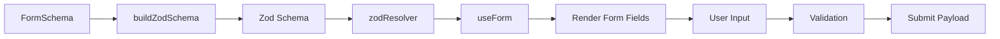
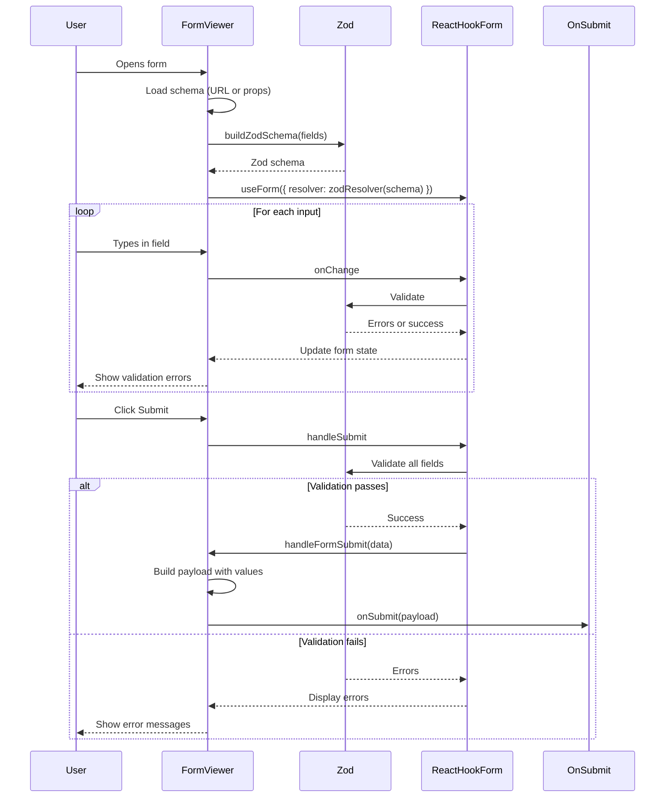

# FormViewer.tsx - Detailed Documentation

This document provides a comprehensive explanation of the `FormViewer.tsx` component, which is responsible for rendering and validating forms created with the Form Builder.

---

## Table of Contents

1. [Overview](#overview)
2. [Imports](#imports)
3. [Zod Schema Builder](#zod-schema-builder)
4. [RenderField Component](#renderfield-component)
5. [FormViewer Component](#formviewer-component)
6. [Form Submission](#form-submission)
7. [Complete Data Flow](#complete-data-flow)

---

## Overview

`FormViewer.tsx` renders a dynamic form based on a `FormSchema` configuration. It uses:
- **react-hook-form** for form state management
- **Zod** for schema-based validation
- **shadcn/ui** components for styling



---

## Imports

```tsx
import { useForm } from 'react-hook-form';
import { zodResolver } from '@hookform/resolvers/zod';
import { z } from 'zod';
```

| Import | Purpose |
|--------|---------|
| `useForm` | React Hook Form's main hook for form state |
| `zodResolver` | Connects Zod schemas to react-hook-form |
| `z` | Zod schema builder |

---

## Zod Schema Builder

The `buildZodSchema` function dynamically generates a Zod validation schema based on field configurations.

### Function Signature
```tsx
const buildZodSchema = (fields: FormFieldInternal[]) => z.object({...})
```

### How It Works

For each field in the form, it creates an appropriate Zod schema:

### Text & Textarea Fields
```tsx
case 'text':
case 'textarea': {
  let strSchema = z.string();
  
  // Add min length if configured
  if (v.minLength !== undefined && v.minLength >= 0) {
    strSchema = strSchema.min(v.minLength, `Minimum ${v.minLength} characters required`);
  }
  
  // Add max length if configured
  if (v.maxLength !== undefined && v.maxLength >= 0) {
    strSchema = strSchema.max(v.maxLength, `Maximum ${v.maxLength} characters allowed`);
  }
  
  // Handle required vs optional
  fieldSchema = field.required 
    ? strSchema.min(1, v.requiredMessage || 'This field is required')
    : strSchema.optional().or(z.literal(''));
  break;
}
```

**Example**: A text field with `minLength: 5`, `maxLength: 100`, `required: true`:
- Valid: `"Hello World"` ✓
- Invalid: `"Hi"` ✗ (too short)
- Invalid: `""` ✗ (required)

---

### Email Field
```tsx
case 'email': {
  const emailSchema = z.string().email(v.patternMessage || 'Invalid email address');
  fieldSchema = field.required 
    ? emailSchema.min(1, v.requiredMessage || 'This field is required')
    : emailSchema.optional().or(z.literal(''));
  break;
}
```

**Built-in validation**: Uses Zod's `.email()` validator which checks for valid email format.

**Example**:
- Valid: `"user@example.com"` ✓
- Invalid: `"not-an-email"` ✗

---

### Phone Field
```tsx
case 'phone': {
  const phoneRegex = /^\+?[0-9\s\-\(\)]{7,20}$/;
  const phoneSchema = z.string().regex(phoneRegex, v.patternMessage || 'Invalid phone number');
  // ...
}
```

**Regex Pattern Breakdown**:
| Part | Meaning |
|------|---------|
| `^\+?` | Optional `+` at start |
| `[0-9\s\-\(\)]` | Digits, spaces, dashes, parentheses |
| `{7,20}` | Between 7 and 20 characters |
| `$` | End of string |

**Valid Examples**:
- `"+1 (555) 123-4567"` ✓
- `"9876543210"` ✓
- `"+44 20 7946 0958"` ✓

---

### Number Field
```tsx
case 'number': {
  let numSchema = z.coerce.number();  // Coerces string to number
  
  if (v.minValue !== undefined) {
    numSchema = numSchema.min(v.minValue, `Minimum value is ${v.minValue}`);
  }
  if (v.maxValue !== undefined) {
    numSchema = numSchema.max(v.maxValue, `Maximum value is ${v.maxValue}`);
  }
  
  fieldSchema = field.required 
    ? numSchema
    : z.union([numSchema, z.literal('')]);  // Allow empty string if optional
  break;
}
```

**Key Point**: `z.coerce.number()` converts the input string to a number before validation.

---

### Date Field
```tsx
case 'date': {
  let dateSchema = z.string();
  
  if (v.minDate) {
    dateSchema = dateSchema.refine(
      (val) => !val || val >= v.minDate!,
      `Date must be on or after ${v.minDate}`
    );
  }
  if (v.maxDate) {
    dateSchema = dateSchema.refine(
      (val) => !val || val <= v.maxDate!,
      `Date must be on or before ${v.maxDate}`
    );
  }
  // ...
}
```

**How `.refine()` works**: Custom validation function that returns `true` (valid) or `false` (invalid).

**Example** with `minDate: "2024-01-01"`, `maxDate: "2024-12-31"`:
- Valid: `"2024-06-15"` ✓
- Invalid: `"2023-12-25"` ✗ (before min)
- Invalid: `"2025-01-01"` ✗ (after max)

---

### Checkbox Field
```tsx
case 'checkbox': {
  const requiredMsg = v.requiredMessage || 'Required';
  fieldSchema = field.required 
    ? z.boolean().refine(val => val === true, { message: requiredMsg })
    : z.boolean();
  break;
}
```

**Required Checkbox**: Must be checked (`true`) to pass validation.

---

### Checklist Field
```tsx
case 'checklist': {
  let arrSchema = z.array(z.string());
  const minSel = v.minSelections ?? (field.required ? 1 : 0);
  
  if (minSel > 0) {
    arrSchema = arrSchema.min(minSel, v.requiredMessage || `Select at least ${minSel} option(s)`);
  }
  if (v.maxSelections !== undefined) {
    arrSchema = arrSchema.max(v.maxSelections, `Select at most ${v.maxSelections} option(s)`);
  }
  fieldSchema = arrSchema;
  break;
}
```

**Example** with `minSelections: 2`, `maxSelections: 4`:
- Valid: `["Option A", "Option B"]` ✓
- Invalid: `["Option A"]` ✗ (too few)
- Invalid: `["A", "B", "C", "D", "E"]` ✗ (too many)

---

### File Field (Special Case)
```tsx
case 'file': {
  // Zod doesn't natively support FileList, so we use z.any()
  // Actual validation happens via react-hook-form's rules prop
  fieldSchema = z.any();
  break;
}
```

File validation is handled separately because Zod doesn't support `FileList`:

```tsx
const fileRules: any = {};
if (field.type === 'file') {
    const validators: ((val: FileList) => true | string)[] = [];
    
    // Max files validation
    if (field.maxFiles) {
      validators.push((val: FileList) => 
        (!val || val.length <= field.maxFiles!) || 
        `Maximum ${field.maxFiles} file(s) allowed`
      );
    }
    
    // Max file size validation (per file)
    if (v.maxFileSize) {
      validators.push((val: FileList) => {
        if (!val || val.length === 0) return true;
        for (let i = 0; i < val.length; i++) {
          if (val[i].size > v.maxFileSize! * 1024) {
            return `File "${val[i].name}" exceeds ${v.maxFileSize} KB limit`;
          }
        }
        return true;
      });
    }
    
    // Combine all validators
    fileRules.validate = (val: FileList) => {
      if (!val || val.length === 0) {
        return field.required ? requiredMsg : true;
      }
      for (const validator of validators) {
        const result = validator(val);
        if (result !== true) return result;
      }
      return true;
    };
}
```

---

## RenderField Component

The `RenderField` component renders the appropriate input based on field type.

### Switch Statement Structure
```tsx
const RenderField = ({ field, formField }) => {
  switch (field.type) {
    case 'textarea':     return <Textarea ... />;
    case 'select':       return <select ... />;
    case 'checkbox':     return <input type="checkbox" ... />;
    case 'checklist':    return <div with multiple checkboxes ... />;
    case 'radio':        return <div with radio buttons ... />;
    case 'file':         return <drag-drop file uploader ... />;
    case 'range':        return <input type="range" ... />;
    case 'min_max':      return <two number inputs ... />;
    default:             return <Input type={computed} ... />;
  }
};
```

### Default Case (text, email, phone, date, number)
```tsx
default:
  // Handle number input with optional spinner disable
  if (field.type === 'number') {
    return (
      <Input 
        type="number"
        placeholder={field.placeholder} 
        {...formField} 
        value={formField.value ?? ''}
        // CSS to hide spinners if disableSpinners is true
        className={field.disableSpinners ? '[appearance:textfield] [&::-webkit-outer-spin-button]:appearance-none [&::-webkit-inner-spin-button]:appearance-none' : ''}
        // Prevent scroll wheel from changing value
        onWheel={field.disableSpinners ? (e) => e.target.blur() : undefined}
      />
    );
  }
  
  return (
    <Input 
      type={field.type === 'date' ? 'date' : field.type === 'phone' ? 'tel' : 'text'} 
      placeholder={field.placeholder} 
      {...formField} 
      value={formField.value ?? ''}
    />
  );
```

---

## FormViewer Component

### Props Interface
```tsx
interface FormViewerProps {
  schema?: FormSchema;          // Complete form schema with fields
  fields?: FormFieldInternal[]; // Alternative: just fields array
  onSubmit?: (data: any) => void; // Custom submit handler
}
```

### Two Usage Modes

**1. Standalone Mode** (loaded from URL):
```tsx
// Route: /form-builder/view/:id
// Loads schema from localStorage using the ID
```

**2. Embedded Mode** (passed as prop):
```tsx
// Used in preview modal within FormBuilder
<FormViewer schema={formSchema} />
```

### Form Initialization
```tsx
// Calculate default values for each field type
const defaultValues = useMemo(() => {
  const values: Record<string, any> = {};
  fields.forEach(field => {
    if (field.type === 'checkbox') values[fieldId] = false;
    else if (field.type === 'checklist') values[fieldId] = [];
    else if (field.type === 'range') values[fieldId] = field.min ?? 0;
    else if (field.type === 'min_max') values[fieldId] = { min: '', max: '' };
    else values[fieldId] = "";
  });
  return values;
}, [fields]);

// Build Zod schema dynamically
const zodSchema = useMemo(() => buildZodSchema(fields), [fields]);

// Initialize react-hook-form with Zod resolver
const form = useForm({
  resolver: zodResolver(zodSchema),
  defaultValues,
  mode: "onChange"  // Validate on every change
});
```

---

## Form Submission

### Payload Structure
```tsx
const handleFormSubmit = (data: any) => {
  // Build payload with form schema and field values
  const fieldsWithValues = fields.map(field => {
    const fieldId = field.id;
    let value = fieldId ? data[fieldId] : undefined;
    
    // Handle file type - convert FileList to file info array
    if (field.type === 'file' && value instanceof FileList) {
      value = Array.from(value).map(file => ({
        name: file.name,
        size: file.size,
        type: file.type
      }));
    }
    
    // Return field with value embedded
    return {
      ...field,
      value: value
    };
  });

  const payload = {
    id: activeSchema?.id || 'form_submission',
    name: formTitle,
    description: formDescription,
    fields: fieldsWithValues,
    submittedAt: new Date().toISOString()
  };

  console.log("Form Submitted:", payload);
  if (onSubmit) {
    onSubmit(payload);
  } else {
    alert("Form submitted successfully!\n" + JSON.stringify(payload, null, 2));
  }
};
```

### Example Payload
```json
{
  "id": "form_abc123",
  "name": "Contact Form",
  "description": "Contact us",
  "fields": [
    {
      "id": "field_1",
      "type": "text",
      "label": "Name",
      "required": true,
      "value": "John Doe"
    },
    {
      "id": "field_2",
      "type": "email",
      "label": "Email",
      "required": true,
      "value": "john@example.com"
    },
    {
      "id": "field_3",
      "type": "checklist",
      "label": "Interests",
      "options": ["Sports", "Music", "Art"],
      "value": ["Sports", "Music"]
    }
  ],
  "submittedAt": "2024-12-05T12:30:00.000Z"
}
```

---

## Complete Data Flow



---

## Key Takeaways

1. **Zod handles most validation** - String, number, email, phone, date, checkbox, checklist, select, radio
2. **File validation is special** - Uses react-hook-form's `rules` prop because Zod doesn't support `FileList`
3. **Schema is built dynamically** - `buildZodSchema()` creates validation rules based on field configuration
4. **Payload includes full schema** - On submit, the entire form structure with values is returned
5. **Two usage modes** - Standalone (URL route) or embedded (preview modal)
